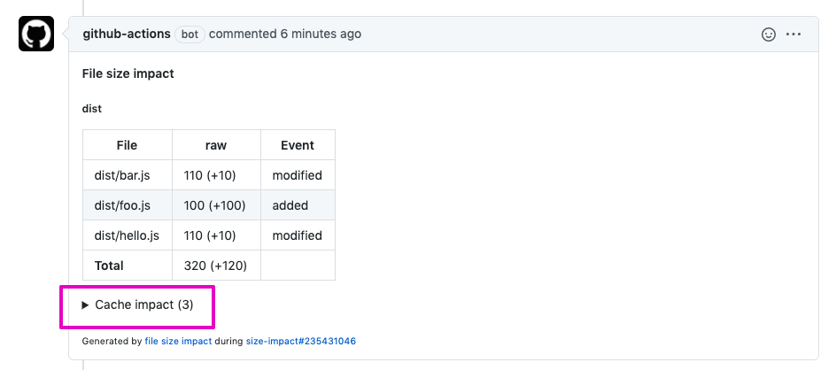
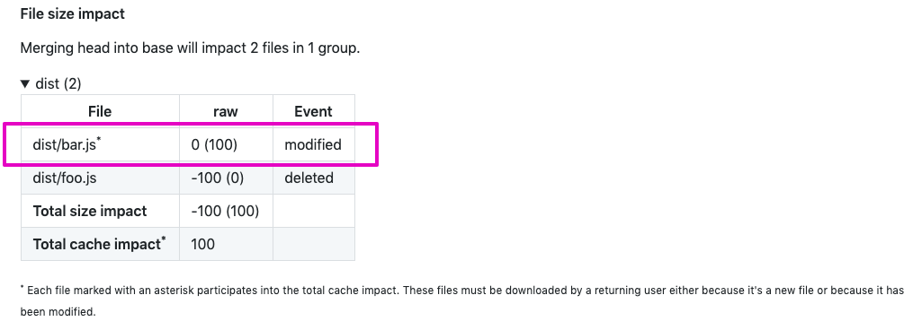
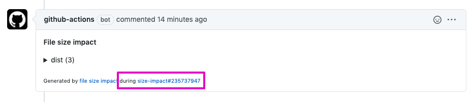

# Table of contents

- [reportFileSizeImpact](#reportFileSizeImpact)
  - [logLevel](#loglevel)
  - [projectDirectoryUrl](#projectDirectoryUrl)
  - [trackingConfig](#trackingConfig)
  - [manifestConfig](#manifestConfig)
  - [installCommand](#installCommand)
  - [buildCommand](#buildCommand)
  - [transformations](#transformations)
  - [cacheImpact](#cacheImpact)
  - [runLink](#runLink)
  - [formatSize](#formatSize)
- [readGithubWorkflowEnv](#readGithubWorkflowEnv)
- [Exclude specific size impacts](#Exclude-specific-size-impacts)
  - [showSizeImpact](#showSizeImpact)

# reportFileSizeImpact

`reportFileSizeImpact` is an async function that will generate file size impact analysis on a pull request and post a comment with the result of this analysis.

```js
import { reportFileSizeImpact, raw } from "@jsenv/file-size-impact"

await reportFileSizeImpact({
  logLevel: "info",
  projectDirectoryUrl: "file:///directory",
  githubToken: "xxx",
  repositoryOwner: "jsenv",
  repositoryName: "jsenv-file-size-impact",
  pullRequestNumber: 10,
  installCommand: "npm install",
  buildCommand: "npm run build",
  trackingConfig: {
    dist: {
      "./dist/**/*.js": true,
    },
  },
  manifestConfig: {
    "./dist/**/manifest.json": true,
  },
  transformations: { raw },
})
```

— source code at [src/reportFileSizeImpact.js](../src/reportFileSizeImpact.js).

## logLevel

`logLevel` parameter controls verbosity of logs during the function execution.

The list of available logLevel values can be found on [@jsenv/logger documentation](https://github.com/jsenv/jsenv-logger#list-of-log-levels)

## projectDirectoryUrl

`projectDirectoryUrl` parameter is a string leading to your project root directory. This parameter is **required**.

## trackingConfig

`trackingConfig` parameter is an object used to configure group of files you want to track. This parameter is optional with a default value exported in [src/jsenvTrackingConfig.js](./src/jsenvTrackingConfig.js)

`trackingConfig` keys are group names that will appear in the generated comment.
`trackingConfig` values are `specifierMetaMap` as documented in https://github.com/jsenv/jsenv-url-meta#normalizespecifiermetamap.

For every group you track there will be a corresponding line in the generated pull request comment as visible in [docs/comment-example.md](./comment-example.md)

For example you can create two groups like this:

```js
const trackingConfig = {
  whatever: {
    "./dist/whatever/**/*.js": true,
  },
  dist: {
    "./dist/**/*.js": true,
    "./dist/whatever/**/*.js": false,
  },
}
```

And the generated comment will have two expandable section.

<details>
  <summary>whatever</summary>
  Analysis for files matching whatever group
</details>

<details>
  <summary>dist</summary>
  Analysis for files matching dist group
</details>

## manifestConfig

Manifest where introduced by webpack in https://github.com/danethurber/webpack-manifest-plugin. There is the equivalent for rollup at https://github.com/shuizhongyueming/rollup-plugin-output-manifest.

The concept is to be able to remap generated file like `file.4798774987w97er984798.js` back to `file.js`.

Without this, comparison of directories accross branches would consider generated files as always new because of their dynamic names.

`manifestConfig` parameter is an object controlling if a manifest json file will be taken into account when generating snapshot. The parameter also control the name of the manifest file. This parameter is optional with a default configured to handle any `manifest.json` file inside a `dist` directory as a manifest json file. It translates to the following value:

```js
const manifestConfig = {
  "./dist/**/manifest.json": true,
}
```

This parameter reuse [trackingConfig](#trackingConfig) type and `specifierMetaMap` as documented in https://github.com/jsenv/jsenv-url-meta#normalizespecifiermetamap.

## installCommand

`installCommand` parameter is a string representing the command to run in order to install things just after a switching to a git branch. This parameter is optional with a default value of `"npm install"`.

## buildCommand

`buildCommand` parameter is a string representing the command to run in order to generate files. This parameter is optional with a default value of `"npm run-script build"`.

## transformations

`transformations` parameter is an object used to transform files content before computing their size. This parameter is optional with a default tracking file size without transformation called `raw`.

You can use this parameter to track file size after gzip compression.

```js
import {
  reportFileSizeImpact,
  readGithubWorkflowEnv,
  raw,
  gzip,
  brotli,
} from "@jsenv/file-size-impact"

reportFileSizeImpact({
  ...readGithubWorkflowEnv(),
  transformations: { raw, gzip, brotli },
})
```

And the pull request comment now contains gzip size. Check [docs/comment-example.md#basic-example--gzip--brotli](./comment-example.md#basic-example--gzip--brotli) to see how it looks like. `raw`, `gzip` and `brotli` compression can be enabled this way.

It's also possible to control compression level.

```js
import { raw, gzip } from "@jsenv/file-size-impact"

const transformations = {
  raw,
  gzip7: (buffer) => gzip(buffer, { level: 7 }),
  gzip9: (buffer) => gzip(buffer, { level: 9 }),
}
```

Finally `transformations` can be used to add custom transformations.

```js
import { raw, gzip } from "@jsenv/file-size-impact"

const transformations = {
  raw,
  trim: (buffer) => String(buffer).trim(),
}
```

## cacheImpact

`cacheImpact` parameter is a boolean controlling if cache impact will appear in the generated comment. It is used to analyse how many files and bytes users will have to redownload if the pull request is merged. This parameter is optional and disabled by default.



When you enable this parameter it's possible to see a file reported with a file size impact of 0.



This is because even if the file size is not impacted, a returning user still have to download a modified file.

## runLink

`runLink` parameter allow to put a link in the generated comment body. It is used to indicates where file size impact was runned.



By default this parameter is returned by [readGithubWorkflowEnv](#readGithubWorkflowEnv) meaning it comes for free inside a github workflow.

When outside a github workflow you can pass you own `runLink` as in the example below where it is assumed that script is runned by jenkins.

```js
const runLink = {
  url: process.env.BUILD_URL,
  text: `${process.env.JOB_NAME}#${process.env.BUILD_ID}`,
}
```

## formatSize

`formatSize` parameter controls the display of file size. This parameter is optionnal, the default value doing an english formatting of a number. Check source code if you want to pass a custom function.

# readGithubWorkflowEnv

`readGithubWorkflowEnv` is a function meant to be runned inside a github workflow. It returns an object with parameters that can be forwarded to `reportFileSizeImpact`.

```js
import { readGithubWorkflowEnv } from "@jsenv/file-size-impact"

const {
  projectDirectoryUrl,
  githubToken,
  repositoryOwner,
  repositoryName,
  pullRequestNumber,
  runLink,
} = readGithubWorkflowEnv()
```

— source code at [src/readGithubWorkflowEnv.js](../src/readGithubWorkflowEnv.js).

# Exclude specific size impacts

Size impact analysis occurs only if the file was deleted, added or modified between the base branch and after merging. To detect if the file is modified we compare file content on base branch and after merging. By default every file size impact is shown. You can control if the file ends up displayed in the github comment using `showSizeImpact` documented below.

## showSizeImpact

`showSizeImpact` is a function that can appear in your `trackingConfig` as shown in the code below.

```js
import { reportFileSizeImpact, raw } from "@jsenv/file-size-impact"

await reportFileSizeImpact({
  transformations: { raw },
  trackingConfig: {
    dist: {
      "**/*.html": {
        showSizeImpact: ({ sizeImpactMap }) => Math.abs(sizeImpactMap.raw) > 10,
      },
    },
  },
})
```

`showSizeImpact` receives named parameters and should return a boolean. To illustrates the named parameter you will receive check the code below. It shows an example of how it could be called.

```js
showSizeImpact({
  fileRelativeUrl: "dist/file.js",
  event: "modified",
  sizeImpactMap: {
    raw: 100,
    gzip: -5,
  },
  sizeMapOnBase: {
    raw: 200,
    gzip: 20,
  },
  sizeMapAfterMerge: {
    raw: 300,
    gzip: 15,
  },
})
```

### fileRelativeUrl

A string representing the file url relative to [projectDirectoryUrl](#projectDirectoryUrl).

### event

A string that can be either `added`, `removed`, `modified`.

### sizeImpactMap

An object mapping all transformations to a number representing impact on that file size.

### sizeMapOnBase

An object mapping all transformations to a number corresponding to file size on base branch. This parameter is `null` when event is `added` because the file did not exists on base branch.

### sizeMapAfterMerge

An object mapping all transformations to a number corresponding to file size after merging pr in base branch. This parameter is `null` when event is `deleted` because the file is gone.
