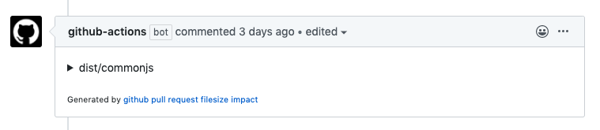
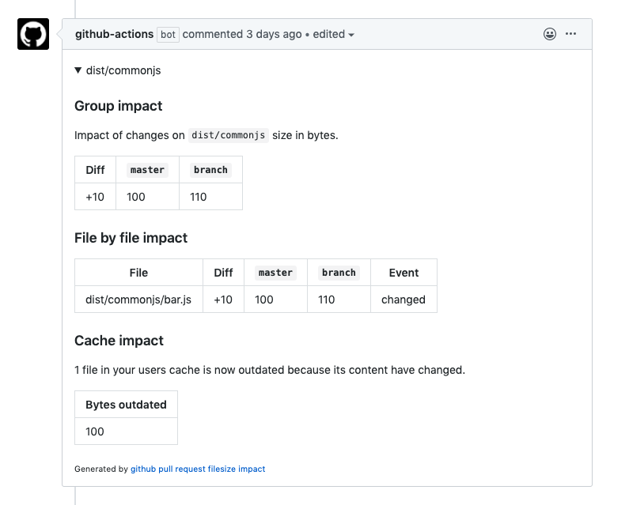

# github-pull-request-filesize-impact

Monitor pull request impact on file sizes.

[](https://github.com/jsenv/jsenv-github-pull-request-filesize-impact/packages)
[](https://www.npmjs.com/package/@jsenv/github-pull-request-filesize-impact)
[](https://github.com/jsenv/jsenv-github-pull-request-filesize-impact/actions?workflow=ci)
[](https://codecov.io/gh/jsenv/jsenv-github-pull-request-filesize-impact)

# Table of contents

- [Presentation](#Presentation)
- [Installation](#Installation)
- [How it works](#How-it-works)
  - [Configuration for Github workflow](#Configuration-for-github-workflow)
    - [Fork issue](#Fork-issue)
  - [Configuration outside Github workflow](#Configuration-outside-github-workflow)
- [generateSnapshotFile](#generateSnapshotFile)
  - [projectDirectoryUrl](#projectDirectoryUrl)
  - [logLevel](#loglevel)
  - [trackingConfig](#trackingConfig)
  - [transformations](#transformations)
  - [manifestFilePattern](#manifestFilePattern)
- [reportSizeImpactIntoGithubPullRequest](#reportSizeImpactIntoGithubPullRequest)
  - [projectDirectoryUrl](#projectDirectoryUrl)
  - [logLevel](#loglevel)
  - [baseSnapshotFileRelativeUrl](#baseSnapshotFileRelativeUrl)
  - [headSnapshotFileRelativeUrl](#headSnapshotFileRelativeUrl)
  - [commentSections](#commentSections)
  - [generatedByLink](#generatedByLink)
  - [formatSize](#formatsize)
- [Why merge](#Why-merge)

# Presentation

`@jsenv/github-pull-request-filesize-impact` comment your pull request on github to see the impact of changes on specific file sizes.

The screenshot below shows how it is integrated to a github pull request.



The comment can be expanded to get more details.



# Installation

```console
npm install --save-dev @jsenv/github-pull-request-filesize-impact
```

# How it works

In order to know a given pull request size impact two functions are needed: `generateSnapshotFile` and `reportSizeImpactIntoGithubPullRequest`.

`generateSnapshotFile` generates a `.json` file saving file size to compare them later. It must be runned twice:

- Once on pull request base branch
- Once on a state where pull request head has been merged into its base.

Then `reportSizeImpactIntoGithubPullRequest` can be called. It reads these two `.json` files, compare them and comment the pull request accordingly.

To configure this for your project check [Configuration for Github workflow](#Configuration-for-github-workflow) and [Configuration outside Github workflow](#Configuration-outside-Github-workflow).

## Configuration for GitHub workflow

You can see how this can be integrated in a GitHub workflow in [.github/workflows/size-impact.yml](https://github.com/jsenv/jsenv-github-pull-request-filesize-impact/blob/7318a582a18760794dfb86ec37c0a2c0b28430a4/.github/workflows/size-impact.yml)

And also see several runs for this workflow at https://github.com/jsenv/jsenv-github-pull-request-filesize-impact/actions?workflow=size-impact

### Fork issue

Using GitHub workflow has one drawback: When a fork opens a pull request the workflow fails. This is because the workflow is runned inside the forked repository. GITHUB_TOKEN from forked repository is not allowed to post comment inside main repository.

Check https://github.community/t5/GitHub-Actions/Token-permissions-for-forks-once-again/td-p/33839 for more information.

## Configuration outside GitHub workflow

`generateSnapshotFile` needs to be runned twice in a given git state. To setup your git state check [Configuration for Github workflow](./Configuration-for-Github-workflow). The exact code is up to you according to your execution environment.

`reportSizeImpactIntoGithubPullRequest` needs special `process.env` values and throw if they are missing. These variables are available in a github workflow, when outside you must provide them manually. The code below shows what `process.env` values must be set.

```js
import { reportSizeImpactIntoGithubPullRequest } from "@jsenv/github-pull-request-filesize-impact"

const githubToken = "github-personnal-access-token"
const githubRepository = "repository-owner/repository-name"
const pullRequestNumber = 1
const pullRequestRef = "pr-name"

process.env.GITHUB_EVENT_NAME = "pull_request"
process.env.GITHUB_REPOSITORY = githubRepository
process.env.GITHUB_REF = `refs/pull/${pullRequestNumber}/merge`
process.env.GITHUB_BASE_REF = "master"
process.env.GITHUB_HEAD_REF = pullRequestRef
process.env.GITHUB_TOKEN = githubToken

reportSizeImpactIntoGithubPullRequest({
  projectDirectoryUrl: "file:///Users/directory",
})
```

If you where inside travis you would write `process.env.GITHUB_REPOSITORY = process.env.TRAVIS_REPO_SLUG`. As documented in https://docs.travis-ci.com/user/environment-variables/#default-environment-variables

Also be sure `githubToken` has the right to read/write comments on issues.

# generateSnapshotFile

`generateSnapshotFile` is an async function analysing file sizes per directory and saving the result into a json file.

```js
import { generateSnapshotFile } from "@jsenv/github-pull-request-filesize-impact"

await generateSnapshotFile({
  projectDirectoryUrl: "file:///directory",
  trackingConfig: {
    dist: {
      "./dist/**/*.js": true,
    },
  },
  snapshotFileRelativeUrl: "./size-snapshot.json",
})
```

— source code at [src/generateSnapshotFile.js](./src/generateSnapshotFile.js).

## projectDirectoryUrl

`projectDirectoryUrl` parameter is a string leading to your project root directory. This parameter is **required**.

## logLevel

`logLevel` parameter controls verbosity of logs during the function execution.

The list of available logLevel values can be found on [@jsenv/logger documentation](https://github.com/jsenv/jsenv-logger#list-of-log-levels)

## trackingConfig

`trackingConfig` parameter is an object used to configure group of files you want to track. This parameter is optional with a default value exported in [src/jsenvTrackingConfig.js](./src/jsenvTrackingConfig.js)

`trackingConfig` keys are group names that will appear in the generated comment.
`trackingConfig` values are `specifierMetaMap` as documented in https://github.com/jsenv/jsenv-url-meta#normalizespecifiermetamap.

For every group you track there will be a corresponding line in the generated pull request comment as visible in [docs/comment-example.md](./docs/comment-example.md)

For example you can create two groups like this:

```js
const trackingConfig = {
  whatever: {
    "./dist/whatever/**/*.js": true,
  },
  dist: {
    "./dist/**/*.js": true,
    "./dist/whatever/**/*.js": false,
  },
}
```

And the generated comment will have two expandable section.

<details>
  <summary>whatever</summary>
  Analysis for files matching whatever group
</details>

<details>
  <summary>dist</summary>
  Analysis for files matching dist group
</details>

## transformations

`transformations` parameter is an object used to transform files content before computing their size. This parameter is optional with a default value of `{ none: (buffer) => bufer }`.

You can use this parameter to track file size after gzip compression.

```js
import { generateSnapshotFile, none, gzip } from "@jsenv/github-pull-request-filesize-impact"

await generateSnapshotFile({
  projectDirectoryUrl: "file:///directory",
  transformations: { none, gzip },
})
```

And the pull request comment now contains gzip size. Check [docs/comment-example.md#introduce-gzip](./docs/comment-example.md#introduce-gzip) to see how it looks like.

You can enable `none`, `gzip` and `brotli` compression this way. `transformations` can be used to add custom transformations.

```js
import { none, gzip } from "@jsenv/github-pull-request-filesize-impact"

const transformations = {
  none,
  trim: (buffer) => String(buffer).trim(),
}
```

## manifestFilePattern

`manifestFilePattern` parameter is a string controlling if a manifest json file will be taken into account when generating snapshot. The parameter also control the name of the manifest file. This parameter is optional with a default value of `./**/manifest.json`.

Manifest where introduced by webpack in https://github.com/danethurber/webpack-manifest-plugin. There is the equivalent for rollup at https://github.com/shuizhongyueming/rollup-plugin-output-manifest.

The concept is to be able to remap generated file like `file.4798774987w97er984798.js` back to `file.js`.

Without this, comparison of directories accross branches would consider generated files as always new because of their dynamic names.

# reportSizeImpactIntoGithubPullRequest

`reportSizeImpactIntoGithubPullRequest` is an async function comparing two directory snapshots and commenting a github pull request with the comparison result.

```js
import { reportSizeImpactIntoGithubPullRequest } from "@jsenv/github-pull-request-filesize-impact"

await reportSizeImpactIntoGithubPullRequest({
  projectDirectoryUrl: "file:///directory",
  baseSnapshotFileRelativeUrl: "../snapshot.base.json",
  headSnapshotFileRelativeUrl: "../snapshot.head.json",
  logLevel: "info",
  generatedByLink: true,
})
```

— source code at [src/reportSizeImpactIntoGithubPullRequest.js](./src/reportSizeImpactIntoGithubPullRequest.js).

## baseSnapshotFileRelativeUrl

`baseSnapshotFileRelativeUrl` parameter is a string leading to the base snapshot file. This parameter is **required**.

## headSnapshotFileRelativeUrl

`headSnapshotFileRelativeUrl` parameter is a string leading to the head snapshot file. This parameter is **required**.

## commentSections

`commentSections` parameter is an object controlling which comment sections are enabled and their order. This parameter is optionnal and enable `groupImpact`, `fileByFileImpact` and `cacheImpact` section in that order. Check [docs/comment-example.md#basic-example](./docs/comment-example.md#basic-example) to see the comment sections.

You can control sections order because it follow `commentSections` keys order. You can also control which section are enabled at all. For instance [docs/comment-example.md#group-disabled-filebyfile-enabled-cache-disabled](./docs/comment-example.md#group-disabled-filebyfile-enabled-cache-disabled) can be generated by passing `commentSections` below.

```js
const commentSections = { fileByFileImpact: true }
```

> This parameter could be an array. Using an object was decided in case each section becomes configurable in the future.

## generatedByLink

`generatedByLink` parameter controls if pull request comment contains a generated by message. This parameter is optionnal and enabled by default. This parameter allows someone to understand where the pull request message comes from.

## formatSize

`formatSize` parameter controls the display of file size. This parameter is optionnal, the default value doing an english formatting of a number. Check source code if you want to pass a custom function.

# Why merge

As documented in [How it works](#How-it-works) `generateSnapshotFile` must be called in a state where the pull request is merged into its target. This part explains why it's needed.

To know impacts of a pull request changes on a given branch, these changes must be on the branch. To understand why we will simulate what happens starting from a git tree where:

- There is a `master` branch
- `me` branch is one commit ahead of `master`
- `other` branch is one commit ahead of `master`
- A pull request wants to merge `me` into `master`

> In upcoming "schemas", a capital letter represent a commit.

## Initial git tree

```txt
   ┌───D─── other (A+D)
   │
───A─────── master (A)
   │
   └───B─── me (A+B)
```

Now `other` gets merged into master

## Git tree after merging other branch

```txt
   ┌───D───┐ other (A+D)
   │       │
───A───────D─── master (A+D)
   │
   └───B──── me (A+B)
```

Now we push a commit to `me`

## Git tree after pushing into me branch

```txt
   ┌───D───┐ other (A+D)
   │       │
───A───────D─── master (A+D)
   │
   └───B───E─── me (A+B+E)
```

In this state:

- `me` is 1 commit behind `master` and 2 commits ahead
  > Pull request wants to merge `B,E` and does not contain `D`.
- merging pull request means adding `B+E` into `master`. Master would become `A+D+B+E`.
  > Depending how pull request gets merged order may differ but that's not important for this demonstration.

To compute the actual impact of merging `me` into `master` we must simulate the merge. Let's create a `merge` branch with this state.

## Git tree after creating merge branch

```txt
   ┌───D───┐ other (A+D)
   │       │
───A───────D──── master (A+D)
   │       │
   │       └───┬─── merge (A+D+B+E)
   │           │
   └───B───E───┘ me (A+B+E)
```

If `D` changes overlaps with `E` changes, impact is analysed after these changes are merged.

Moreover `D` changes that are not in `B` or `E` are ignored thanks to diff between `merge` and `master`.

```
merge = A+D+B+E
master = A+D
merge - master = B+E
```
