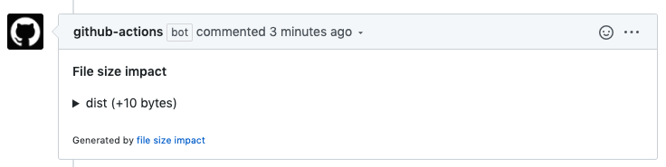
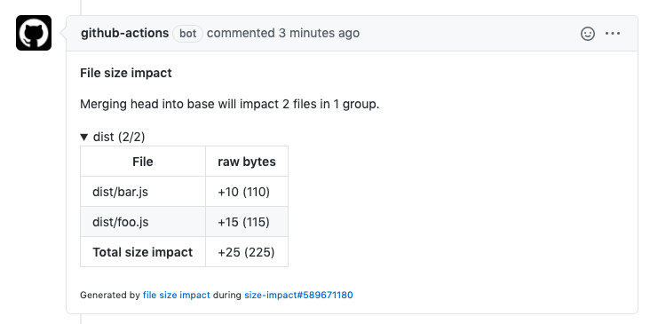
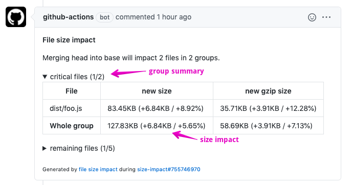

# file-size-impact

Add files size impact into pull requests.

[](https://github.com/jsenv/jsenv-file-size-impact/packages)
[](https://www.npmjs.com/package/@jsenv/file-size-impact)
[](https://github.com/jsenv/jsenv-file-size-impact/actions?workflow=ci)
[](https://codecov.io/gh/jsenv/jsenv-file-size-impact)

# Table of contents

- [Presentation](#Presentation)
- [Configuring a github workflow](#Configuring-a-github-workflow)
- [Configuring a workflow](#configuring-a-workflow)
- [Size impact legend](#Size-impact-legend)
- [API](#API)
- [How it works](#How-it-works)
- [See also](#See-also)

# Presentation

`@jsenv/file-size-impact` analyses a pull request impact on specific files size. This analysis is posted in a comment of the pull request.



The comment can be expanded to see details.



</details>

- Compatible with any workflow like GitHub or Jenkins
- Can track compressed file size
- Configurable to create group of files according to your project. For exemple you can create one group with critical files and a second one for less important files.

# Size impact legend

There is two parts composing the size impact comment that are presented in this section: `group summary` and `size impact`.



## group summary

"critical files (1/2)"

Translates into the following sentence:

"There is a group of files named `critical files` and pull request impacts `1` file out of `2` in this group".

## size impact

"83.45KB (+6.84KB / +8.92%)"

Translates into the following sentence:

"The size after merge is `83.45KB` and pull request adds `6.84KB` representing an increase of `8.92%` of the size before merge"

# Configuring a GitHub workflow

You need:

<details>
  <summary>1. @jsenv/file-size-impact in devDependencies</summary>

```console
npm install --save-dev @jsenv/file-size-impact
```

</details>

<details>
  <summary>2. Create a script file</summary>

`.github/workflows/report-size-impact.js`

```js
import { reportFileSizeImpact, readGithubWorkflowEnv } from "@jsenv/file-size-impact"

reportFileSizeImpact({
  ...readGithubWorkflowEnv(),
  buildCommand: "npm run dist",
  trackingConfig: {
    "dist/commonjs": {
      "./dist/commonjs/**/*": true,
      "./dist/commonjs/**/*.map": false,
    },
  },
})
```

</details>

<details>
  <summary>3. Create a workflow.yml file</summary>

`.github/workflows/size-impact.yml`

```yml
name: size-impact

on: pull_request_target

jobs:
  size-impact:
    strategy:
      matrix:
        os: [ubuntu-latest]
        node: [14.5.0]
    runs-on: ${{ matrix.os }}
    name: report size impact
    steps:
      - name: Setup git
        uses: actions/checkout@v2
      - name: Setup node ${{ matrix.node }}
        uses: actions/setup-node@v1
        with:
          node-version: ${{ matrix.node }}
      - name: npm install
        run: npm install
      - name: Report size impact
        run: node ./.github/workflows/report-size-impact.js
        env:
          GITHUB_TOKEN: ${{ secrets.GITHUB_TOKEN }}
```

</details>

# Configuring a workflow

<details>
  <summary>1. @jsenv/file-size-impact in devDependencies</summary>

```console
npm install --save-dev @jsenv/file-size-impact
```

</details>

<details>
  <summary>2. Create a script file (depends what you use)</summary>

When outside a github workflow you must provide `{ projectDirectoryUrl, githubToken, repositoryOwner, repositoryName, pullRequestNumber }` "manually" to `reportFileSizeImpact`.

The code below is an example for Travis.

`report-size-impact.js`

```js
import { reportFileSizeImpact } from "@jsenv/file-size-impact"

reportFileSizeImpact({
  projectDirectoryUrl: process.env.TRAVIS_BUILD_DIR,
  githubToken: process.env.GITHUB_TOKEN,
  repositoryOwner: process.env.TRAVIS_REPO_SLUG.split("/")[0],
  repositoryName: process.env.TRAVIS_REPO_SLUG.split("/")[1],
  pullRequestNumber: process.env.TRAVIS_PULL_REQUEST,

  buildCommand: "npm run-script dist",
  trackingConfig: {
    "dist/commonjs": {
      "./dist/commonjs/**/*": true,
      "./dist/commonjs/**/*.map": false,
    },
  },
})
```

</details>

<details>
  <summary>3. Create a GitHub token</summary>

In order to have `process.env.GITHUB_TOKEN` you need to create a github token with `repo` scope at https://github.com/settings/tokens/new. After that you need to setup this environment variable. The exact way to do this is specific to your project and tools. Applied to travis you could add it to your environment variables as documented in https://docs.travis-ci.com/user/environment-variables/#defining-variables-in-repository-settings.

</details>

<details>
  <summary>4. Create your workflow (depends what you use)</summary>

`reportFileSizeImpact` must be called in a state where your git repository has been cloned and you are currently on the pull request branch. Inside github workflow this is done by the following lines in `file-size-impact.yml`.

```yml
uses: actions/checkout@v2
uses: actions/setup-node@v1
with:
  node-version: ${{ matrix.node }}
run: npm install
```

In your CI you must replicate this, the corresponding commands looks as below:

```console
git init
git remote add origin $GITHUB_REPOSITORY_URL
git fetch --no-tags --prune origin $PULL_REQUEST_HEAD_REF
git checkout origin/$PULL_REQUEST_HEAD_REF
npm install
node ./report-size-impact.js
```

</details>

# Compression

You can enable compressed file size tracking using the `transformations` parameter.
The following code would track raw and compressed file size (using gzip).

```js
import { reportFileSizeImpact, raw, gzip } from "@jsenv/file-size-impact"

reportFileSizeImpact({
  ...readGithubWorkflowEnv(),
  transformations: { raw, gzip },
})
```

# How it works

In order to analyse the impact of a pull request on file size the following steps are executed:

1. Checkout pull request base branch
2. Execute command to generate files (`npm build` by default)
3. Take a snapshot of generated files
4. Merge pull request into its base
5. Execute command to generate files again
6. Take a second snapshot of generated files
7. Analyse differences between the two snapshots
8. Post or update comment in the pull request

# See also

- API documentation around `reportFileSizeImpact`: [docs/api.md](./docs/api.md)

- An other repository from jsenv monitoring pull requests impacts but on lighthouse score: https://github.com/jsenv/jsenv-lighthouse-score-impact

- A similar GitHub action called `compressed-size-action`: https://github.com/preactjs/compressed-size-action

- A related GitHub action called `size-limit`: https://github.com/andresz1/size-limit-action
