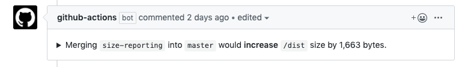

# Github pull request filesize impact

## Table of contents

- [Presentation](#Presentation)
- [Usage](#Usage)

## Presentation

`@jsenv/github-pull-request-filesize-impact` comment your pull request on github to see the impact of changes on specific file sizes.

The screenshot below was taken inside a githug pull request to give you a better idea of the final result.

## Usage

Waiting for a proper documentation you can check `pull request size impact` step in [.github/workflows/ci.yml](./.github/workflows/ci.yml)
