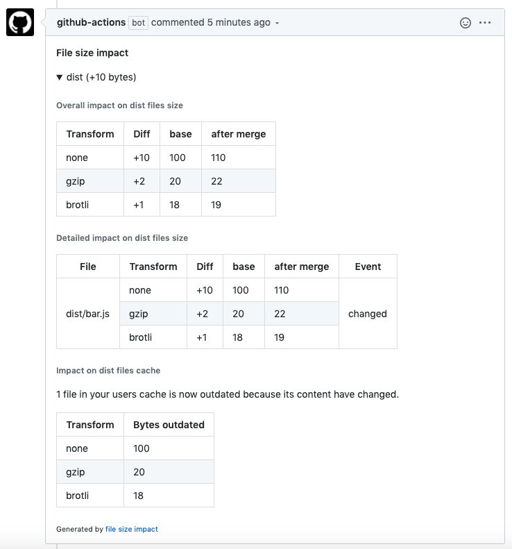

# file-size-impact

Add files size impact into pull requests.

[](https://github.com/jsenv/jsenv-file-size-impact/packages)
[](https://www.npmjs.com/package/@jsenv/file-size-impact)
[](https://github.com/jsenv/jsenv-file-size-impact/actions?workflow=ci)
[](https://codecov.io/gh/jsenv/jsenv-file-size-impact)

# Table of contents

- [Presentation](#Presentation)
- [How it works](#How-it-works)
- [Usage in github workflow](#Usage-in-github-workflow)
- [Usage outside github workflow](#Usage-outside-github-workflow)
- [Monitor compressed size](#Monitor-compressed-size)
- [api](#api)
- [See also](#See-also)

# Presentation

`@jsenv/file-size-impact` analyses a pull request impact on specific files size. This analysis is posted in a comment of the pull request.


The comment can be expanded to get more details.


It can also be configured to track size after compression.



# How it works

In order to analyse the impact of a pull request on file size the following steps are executed:

1. Checkout pull request base branch
2. Execute command to generate files (`npm build` by default)
3. Take a snapshot of generated files
4. Merge pull request into its base
5. Execute command to generate files again
6. Take a second snapshot of generated files
7. Analyse differences between the two snapshots
8. Post or update comment in the pull request

# Usage in github workflow

You need:

- [@jsenv/file-size-impact in devDependencies](#Installation-with-npm)
- [The file runned against a pull request](#githubworkflowsreport-file-size-impactjs)
- [A workflow.yml](#githubworkflowsfile-size-impactyml)

## Installation with npm

```console
npm install --save-dev @jsenv/file-size-impact
```

## .github/workflows/report-file-size-impact.js

```js
import { reportFileSizeImpact, readGithubWorkflowEnv } from "../../index.js"

reportFileSizeImpact({
  ...readGithubWorkflowEnv(),
  buildCommand: "npm run dist",
  trackingConfig: {
    "dist/commonjs": {
      "./dist/commonjs/**/*": true,
      "./dist/commonjs/**/*.map": false,
    },
  },
})
```

## .github/workflows/file-size-impact.yml

```yml
name: file-size-impact

on: pull_request_target

jobs:
  file-size-impact:
    strategy:
      matrix:
        os: [ubuntu-latest]
        node: [14.5.0]
    runs-on: ${{ matrix.os }}
    name: report file size impact
    steps:
      - name: Setup git
        uses: actions/checkout@v2
      - name: Setup node ${{ matrix.node }}
        uses: actions/setup-node@v1
        with:
          node-version: ${{ matrix.node }}
      - name: npm install
        run: npm install
      - name: Report file size impact
        run: node ./.github/workflows/report-file-size-impact.js
        env:
          GITHUB_TOKEN: ${{ secrets.GITHUB_TOKEN }}
```

# Usage outside github workflow

When outside a github workflow you must provide `{ projectDirectoryUrl, githubToken, repositoryOwner, repositoryName, pullRequestNumber }` "manually" to `reportFileSizeImpact`.

For Travis it would be something as below.

```js
import { reportFileSizeImpact } from "@jsenv/file-size-impact"

reportFileSizeImpact({
  projectDirectoryUrl: process.env.TRAVIS_BUILD_DIR,
  githubToken: process.env.GITHUB_TOKEN,
  repositoryOwner: process.env.TRAVIS_REPO_SLUG.split("/")[0],
  repositoryName: process.env.TRAVIS_REPO_SLUG.split("/")[1],
  pullRequestNumber: process.env.TRAVIS_PULL_REQUEST,

  buildCommand: "npm run dist",
  trackingConfig: {
    "dist/commonjs": {
      "./dist/commonjs/**/*": true,
      "./dist/commonjs/**/*.map": false,
    },
  },
})
```

In order to have `process.env.GITHUB_TOKEN` you need to create a github token with `repo` scope at https://github.com/settings/tokens/new. After that you need to setup this environment variable. The exact way to do this is specific to your project and tools. Applied to travis you could add it to your environment variables as documented in https://docs.travis-ci.com/user/environment-variables/#defining-variables-in-repository-settings.

Please note `reportFileSizeImpact` must be called in a state where your git repository has been cloned and you are currently on the pull request branch. Inside github workflow this is done by the following lines in `file-size-impact.yml`.

```yml
uses: actions/checkout@v2
uses: actions/setup-node@v1
with:
  node-version: ${{ matrix.node }}
run: npm install
```

In your CI you must replicate this, the corresponding commands looks as below:

```console
git init
git remote add origin $GITHUB_REPOSITORY_URL
git fetch --no-tags --prune --depth=1 origin $PULL_REQUEST_HEAD_REF
git checkout origin/$PULL_REQUEST_HEAD_REF
npm install
```

# Monitor compressed size

You can enable compressed file size tracking using the `transformations` parameter.
The following code would track raw and compressed file size (using gzip).

```js
import { reportFileSizeImpact, none, gzip } from "@jsenv/file-size-impact"

reportFileSizeImpact({
  ...readGithubWorkflowEnv(),
  transformations: { none, gzip },
})
```

# api

Check [api](./docs/api.md) for documentation around `reportFileSizeImpact`.

# See also

- [jsenv-lighthouse-score-impact](https://github.com/jsenv/jsenv-lighthouse-score-impact)
- [compressed-size-action](https://github.com/preactjs/compressed-size-action)
- [size-limit-action](https://github.com/andresz1/size-limit-action)
