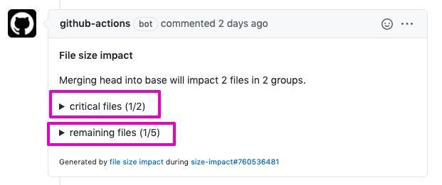
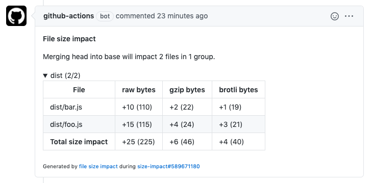
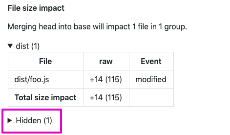
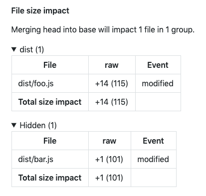

# file-size-impact

Add files size impact into pull requests.

[](https://github.com/jsenv/jsenv-file-size-impact/packages)
[](https://www.npmjs.com/package/@jsenv/file-size-impact)
[](https://github.com/jsenv/jsenv-file-size-impact/actions?workflow=ci)
[](https://codecov.io/gh/jsenv/jsenv-file-size-impact)

# Table of contents

- [Presentation](#Presentation)
- [Pull request comment](#Pull-request-comment)
- [Installation](#Installation)
- [API](#API)
- [Manifest file](#Manifest-file)
- [Ignore some impact](#Ignore-some-impact)
- [How it works](#How-it-works)
- [See also](#See-also)

# Presentation

`@jsenv/file-size-impact` analyses a pull request impact on specific files size. This analysis is posted in a comment of the pull request.


The comment can be expanded to see details.


</details>

- Compatible with any workflow like GitHub or Jenkins
- Can track compressed file size
- Configurable to create group of files according to your project. For example you can create one group with critical files and a second one for less important files.

# Pull request comment

This section document how to read `group summary` and `size impact` in the pull request comment.


`critical files (1/2)` translates into the following sentence:

> "There is a group of files named `critical files` and pull request impacts `1` out of `2` files in this group."

`127.83KB (+6.84KB / +5.65%)` translates into the following sentence:

> "The size after merge is `127.83KB` and pull request adds `6.84KB` representing an increase of `5.65%` of the size before merge."

# Installation

This section explains how integrate file size impact to pull requests on GitHub. To configure a GitHub workflow, see [Configuring a GitHub workflow](#Configuring-a-GitHub-workflow), otherwise see [Configuring a workflow](#Configuring-a-workflow). If you don't know what to choose, prefer a GitHub workflow as it's a bit easier to configure.

## Configuring a GitHub workflow

<details>
  <summary>1. @jsenv/file-size-impact in devDependencies</summary>

```console
npm install --save-dev @jsenv/file-size-impact
```

</details>

<details>
  <summary>2. Create a script file</summary>

`.github/workflows/report-size-impact.js`

```js
import { reportFileSizeImpact, readGithubWorkflowEnv } from "@jsenv/file-size-impact"

reportFileSizeImpact({
  ...readGithubWorkflowEnv(),
  buildCommand: "npm run dist",
  trackingConfig: {
    dist: {
      "./dist/**/*": true,
      "./dist/**/*.map": false,
    },
  },
})
```

</details>

<details>
  <summary>3. Create a workflow.yml file</summary>

`.github/workflows/size-impact.yml`

```yml
name: size-impact

on: pull_request_target

jobs:
  size-impact:
    strategy:
      matrix:
        os: [ubuntu-latest]
        node: [14.5.0]
    runs-on: ${{ matrix.os }}
    name: report size impact
    steps:
      - name: Setup git
        uses: actions/checkout@v2
      - name: Setup node ${{ matrix.node }}
        uses: actions/setup-node@v1
        with:
          node-version: ${{ matrix.node }}
      - name: npm install
        run: npm install
      - name: Report size impact
        run: node ./.github/workflows/report-size-impact.js
        env:
          GITHUB_TOKEN: ${{ secrets.GITHUB_TOKEN }}
```

</details>

## Configuring a workflow

<details>
  <summary>1. @jsenv/file-size-impact in devDependencies</summary>

```console
npm install --save-dev @jsenv/file-size-impact
```

</details>

<details>
  <summary>2. Create a script file (depends what you use)</summary>

When outside a github workflow you must provide `{ projectDirectoryUrl, githubToken, repositoryOwner, repositoryName, pullRequestNumber }` "manually" to `reportFileSizeImpact`.

The code below is an example for Travis.

`report-size-impact.js`

```js
import { reportFileSizeImpact } from "@jsenv/file-size-impact"

reportFileSizeImpact({
  projectDirectoryUrl: process.env.TRAVIS_BUILD_DIR,
  githubToken: process.env.GITHUB_TOKEN,
  repositoryOwner: process.env.TRAVIS_REPO_SLUG.split("/")[0],
  repositoryName: process.env.TRAVIS_REPO_SLUG.split("/")[1],
  pullRequestNumber: process.env.TRAVIS_PULL_REQUEST,

  buildCommand: "npm run dist",
  trackingConfig: {
    dist: {
      "./dist/**/*": true,
      "./dist/**/*.map": false,
    },
  },
})
```

</details>

<details>
  <summary>3. Create a GitHub token</summary>

In order to have `process.env.GITHUB_TOKEN` you need to create a github token with `repo` scope at https://github.com/settings/tokens/new. After that you need to setup this environment variable. The exact way to do this is specific to your project and tools. Applied to travis you could add it to your environment variables as documented in https://docs.travis-ci.com/user/environment-variables/#defining-variables-in-repository-settings.

</details>

<details>
  <summary>4. Create your workflow (depends what you use)</summary>

`reportFileSizeImpact` must be called in a state where your git repository has been cloned and you are currently on the pull request branch. Inside github workflow this is done by the following lines in `file-size-impact.yml`.

```yml
uses: actions/checkout@v2
uses: actions/setup-node@v1
with:
  node-version: ${{ matrix.node }}
run: npm install
```

In your CI you must replicate this, the corresponding commands looks as below:

```console
git init
git remote add origin $GITHUB_REPOSITORY_URL
git fetch --no-tags --prune origin $PULL_REQUEST_HEAD_REF
git checkout origin/$PULL_REQUEST_HEAD_REF
npm install
node ./report-size-impact.js
```

</details>

# API

## reportFileSizeImpact

`reportFileSizeImpact` is an async function that will analyse a pull request file size impact and post a comment with the result of this analysis.

<details>
  <summary>reportFileSizeImpact code example</summary>

```js
import { reportFileSizeImpact, raw } from "@jsenv/file-size-impact"

await reportFileSizeImpact({
  projectDirectoryUrl: "file:///directory",
  logLevel: "info",
  githubToken: "xxx",
  repositoryOwner: "jsenv",
  repositoryName: "jsenv-file-size-impact",
  pullRequestNumber: 10,
  installCommand: "npm install",
  buildCommand: "npm run build",
  trackingConfig: {
    dist: {
      "./dist/**/*.js": true,
    },
  },
  transformations: { raw },
  manifestConfig: {
    "./dist/**/manifest.json": true,
  },
})
```

[implementation](./src/reportFileSizeImpact.js)

</details>

<details>
  <summary>projectDirectoryUrl parameter</summary>

`projectDirectoryUrl` parameter is a string leading to your project root directory. This parameter is **required**.

  </details>

<details>
  <summary>logLevel parameter</summary>

`logLevel` parameter controls verbosity of logs during the function execution. This parameters is optional with a default value of `"info"`.

You likely don't need to modify this parameter. Except eventually to pass `"debug"`: this will enable more verbose logs to follow closely what is hapenning during `reportFileSizeImpact` execution.

The list of available `logLevel` values can be found on [@jsenv/logger documentation](https://github.com/jsenv/jsenv-logger#loglevel).

</details>

<details>
  <summary>trackingConfig parameter</summary>

`trackingConfig` parameter is an object used to configure group of files you want to track. This parameter is optional with a default value exported in [src/jsenvTrackingConfig.js](./src/jsenvTrackingConfig.js)

`trackingConfig` keys are group names that will appear in the generated comment.
`trackingConfig` values are objects associating a pattern to a value. This object is refered as `metaValueMap` in https://github.com/jsenv/jsenv-url-meta.

For example you can create two groups named `critical files` and `remaining files` like this:

```js
import { reportFileSizeImpact } from "@jsenv/file-size-impact"

reportFileSizeImpact({
  trackingConfig: {
    "critical files": {
      "./dist/main.js": true,
      "./dist/main.css": true,
    },
    "remaining files": {
      "./dist/**/*.js": true,
      "./dist/**/*.css": true,
      "./dist/main.js": false,
      "./dist/main.css": false,
    },
  },
})
```



</details>

<details>
  <summary>shouldOpenGroupByDefault parameter</summary>

`shouldOpenGroupByDefault` parameter is a function received named arguments and returning a boolean. When the returned boolean is true, the group is opened by default in the pull request comment.

The following code would always open `critical files` group.

```js
import { reportFileSizeImpact } from "@jsenv/file-size-impact"

reportFileSizeImpact({
  trackingConfig: {
    "critical files": {
      "./dist/main.js": true,
    },
    "remaining files": {
      "./dist/**/*.js": true,
      "./dist/main.js": false,
    },
  },
  shouldOpenGroupByDefault: ({ groupName }) => groupName === "critical files",
})
```

</details>

<details>
  <summary>transformations parameter</summary>

`transformations` parameter is an object used to transform files content before computing their size. This parameter is optional with a default tracking file size without transformation called `raw`.

You can use this parameter to track file size after gzip compression.

```js
import { reportFileSizeImpact, raw, gzip, brotli } from "@jsenv/file-size-impact"

reportFileSizeImpact({
  transformations: { raw, gzip, brotli },
})
```



`raw`, `gzip` and `brotli` compression can be enabled this way.

It's also possible to control compression level.

```js
import { reportFileSizeImpact, raw, gzip } from "@jsenv/file-size-impact"

reportFileSizeImpact({
  transformations: {
    raw,
    gzip7: (buffer) => gzip(buffer, { level: 7 }),
    gzip9: (buffer) => gzip(buffer, { level: 9 }),
  },
})
```

Finally `transformations` can be used to add custom transformations.

```js
import { reportFileSizeImpact, raw, gzip, brotli } from "@jsenv/file-size-impact"

reportFileSizeImpact({
  transformations: {
    raw,
    trim: (buffer) => String(buffer).trim(),
  },
})
```

</details>

<details>
  <summary>installCommand parameter</summary>

`installCommand` parameter is a string representing the command to run in order to install things just after a switching to a git branch. This parameter is optional with a default value of `"npm install"`.

</details>

<details>
  <summary>buildCommand parameter</summary>

`buildCommand` parameter is a string representing the command to run in order to generate files. This parameter is optional with a default value of `"npm run-script build"`.

</details>

<details>

  <summary>manifestConfig parameter</summary>

`manifestConfig` parameter is an object used to configure the location of an optional [manifest file](#Manifest-file). This parameter is optional with a default considering `dist/**/manifest.json` as manifest files.

This parameter reuses the shape of `trackingConfig parameter` (associating pattern + value).

```js
import { reportFileSizeImpact } from "@jsenv/file-size-impact"

reportFileSizeImpact({
  manifestConfig: {
    "./dist/**/manifest.json": true,
  },
})
```

You can disable manifest file handling by passing `manifestConfig: null` (`manifest.json` will be handled as a regular file).

</details>

<details>
  <summary>runLink parameter</summary>

`runLink` parameter allow to put a link to the workflow run in the generated comment body. It is used to indicates where file size impact was runned.


This parameter is returned by [readGithubWorkflowEnv](#readGithubWorkflowEnv) meaning it comes for free inside a GitHub workflow.

Inside an other workflow, you can pass your own `runLink`. As in the example below where it is assumed that script is runned by jenkins.

```js
import { reportFileSizeImpact } from "@jsenv/file-size-impact"

reportFileSizeImpact({
  runLink: {
    url: process.env.BUILD_URL,
    text: `${process.env.JOB_NAME}#${process.env.BUILD_ID}`,
  },
})
```

</details>

## readGithubWorkflowEnv

`readGithubWorkflowEnv` is a function meant to be runned inside a GitHub workflow. It returns an object meant to be forwarded to [reportFileSizeImpact](reportFileSizeImpact).

<details>
  <summary>readGithubWorkflowEnv code example</summary>

```js
import { reportFileSizeImpact, readGithubWorkflowEnv } from "@jsenv/file-size-impact"

const githubWorkflowEnv = readGithubWorkflowEnv()

reportFileSizeImpact({
  projectDirectoryUrl: new URL("./", import.meta.url),
  ...githubWorkflowEnv,
})
```

`githubWorkflowEnv` object looks like this:

```js
const githubWorkflowEnv = {
  projectDirectoryUrl: "/home/runner/work/repo-name/repo-name",
  githubToken: "xxx",
  repositoryOwner: "jsenv",
  repositoryName: "jsenv-file-size-impact",
  pullRequestNumber: 10,
  runLink: {
    url: "https://github.com/jsenv/jsenv-file-size-impact/actions/runs/34",
    text: "workflow-name#34",
  },
}
```

[implementation](./src/readGithubWorkflowEnv.js).

</details>

# Manifest file

Manifest file allows to compare file with dynamic names. The content of a manifest file looks like this:

```json
{
  "dist/file.js": "dist/file.4798774987w97er984798.js"
}
```

These files are generated by build tools. For example by [webpack-manifest-plugin](https://github.com/danethurber/webpack-manifest-plugin) or [rollup-plugin-output-manifest](https://github.com/shuizhongyueming/rollup-plugin-output-manifest/tree/master/packages/main).

# Ignore some impact

By default every file size impact is shown but you can decide to hide some of them dynamically. In the comment below, two files are modified but only one is big enough to be displayed. As a result the impact description says 1 file impacted over 2 and hidden impacts are regrouped inside a `hidden details`.



Opening `hidden details` display impacts that where hidden.



Useful if you have several files always modified by the build but with a size impact of 0. You can also decide that you don't want to show very small size impact. In order to configure this, use [showSizeImpact](#showSizeImpact) documented below.

## showSizeImpact

`showSizeImpact` is a function receiving named parameters that should return a boolean. Boolean use to decide if size impact will be shown or hidden. `showSizeImpact` is part of `trackingConfig parameter` documented in [reportFileSizeImpact](#reportFileSizeImpact).

<details>
  <summary>showSizeImpact code example</summary>

```js
import { reportFileSizeImpact, raw } from "@jsenv/file-size-impact"

await reportFileSizeImpact({
  transformations: { raw },
  trackingConfig: {
    dist: {
      "**/*.html": {
        showSizeImpact: ({ sizeImpactMap }) => Math.abs(sizeImpactMap.raw) > 10,
      },
    },
  },
})
```

</details>

<details>
  <summary>showSizeImpact call example</summary>

Code below illustrates the named parameter passed to `showSizeImpact`.

```js
showSizeImpact({
  fileRelativeUrl: "dist/file.js",
  event: "modified",
  sizeMapBeforeMerge: {
    raw: 200,
    gzip: 20,
  },
  sizeMapAfterMerge: {
    raw: 300,
    gzip: 15,
  },
  sizeImpactMap: {
    raw: 100,
    gzip: -5,
  },
})
```

### fileRelativeUrl

A string representing the file url relative to [projectDirectoryUrl](#projectDirectoryUrl).

### event

A string that can be either `added`, `removed`, `modified`.

### sizeMapBeforeMerge

An object mapping all transformations to a number corresponding to file size on base branch. This parameter is `null` when event is `added` because the file did not exists on base branch.

### sizeMapAfterMerge

An object mapping all transformations to a number corresponding to file size after merging pr in base branch. This parameter is `null` when event is `deleted` because the file is gone.

### sizeImpactMap

An object mapping all transformations to a number representing impact on that file size.

</details>

# How it works

In order to analyse the impact of a pull request on file size the following steps are executed:

1. Checkout pull request base branch
2. Execute command to generate files (`npm build` by default)
3. Take a snapshot of generated files
4. Merge pull request into its base
5. Execute command to generate files again
6. Take a second snapshot of generated files
7. Analyse differences between the two snapshots
8. Post or update comment in the pull request

# See also

- An other repository from jsenv monitoring pull requests impacts but on lighthouse score: https://github.com/jsenv/jsenv-lighthouse-score-impact

- A similar GitHub action called `compressed-size-action`: https://github.com/preactjs/compressed-size-action

- A related GitHub action called `size-limit`: https://github.com/andresz1/size-limit-action
